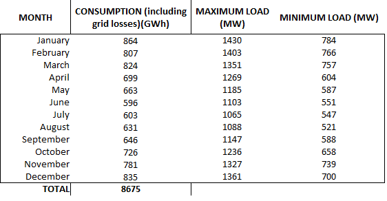

# Getting started
## Power Consumption Visualization
### Overview
This project aims to visualize the power consumption by Estonian cities
for the year 2022. While the data used in this project is not real,
it provides an approximation using random tools for demonstration purposes.

### Dependencies
This project requires the following Python libraries:

- `NumPy`
- `Matplotlib`
- `Pandas`

### Data Sources
The primary data source for this project is a Load Forecast for 2022 obtained from [this resource](https://elering.ee/en/electricity-consumption-and-production#tab0) containing a .xls file
with Load Forecast for 2022 published in 07.01.2020. Although the statistics are not real, 
they serve as a basis for generating synthetic data for visualization.


### The histogram from the [resource](https://elering.ee/en/electricity-consumption-and-production#tab0)


### The histogram from power_consumption.ipynb file.


### Data Preparation
To begin, the Load Forecast data was manually transferred from an Excel file
to create a CSV file containing information about power consumption per month,
maximum load per hour, and minimum load per hour. Since this project focuses on
power consumption per month, the CSV file was tailored accordingly.

Additionally, information about Estonian cities and their respective populations was sourced from 
[here](https://simplemaps.com/data/ee-cities). This data was used to calculate the percentage of 
each city's population relative to the total population of Estonia. By knowing these percentages,
power consumption was distributed among cities based on their population percentages for each month.

### Visualizing Power Consumption
The project provides a visualization tool to display power consumption for a specific date.
To accomplish this, a CSV file containing data for 365 days was created.
Each row in the file represents a single day, with columns for the date, total consumption,
and consumption for each city.

### Implementation Details
The project consists of several Python scripts that handle data processing and visualization.
The key steps involved in the implementation include:

Data retrieval and preprocessing: Load Forecast data and city population data were collected and 
processed to prepare the datasets for visualization.
Data distribution: Power consumption data was distributed among cities based on their population percentages.
Visualization: Matplotlib was used to create visualizations of power consumption over time and for specific dates.

### Usage
To visualize power consumption for a specific date, scroll down to the end in 'power consumption.ipynb' file and
run the draw_bars_using_date(date) function,  passing the desired date in the format 'YYYY-MM-DD' as an argument.

```python
draw_bars_using_date('2022-04-20')
# Note that the year must be 2022!
```


### Future Improvements
Some potential enhancements for this project include:

- Incorporating real-time or historical data for more accurate visualizations.
- Adding interactive features to the visualizations for better user engagement.
- Optimizing code for improved performance and efficiency.
- Creating more function for clients allowing them to visualize:
  - Power consumption by a specific city over some period (A year, months, days, range of dates)
  - Power consumption by a list of typed cities over some period (A year, months, days, range of dates)
- Implementing interactive visualization using Plotly